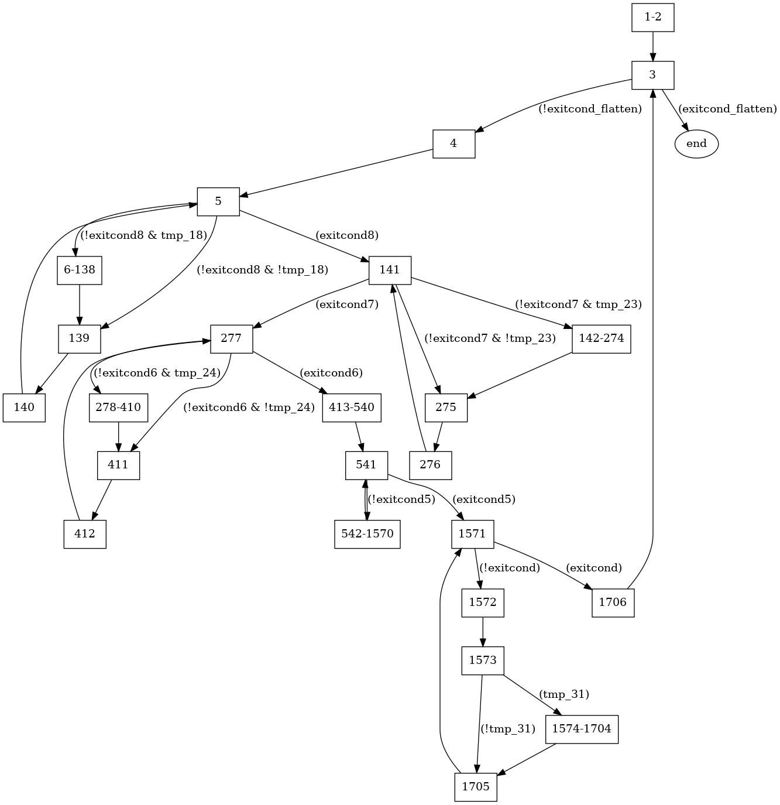

# Vivado FSMGen

FSM Diagram Generator for Xilinx Vivado HLS

## Authors

* André Bannwart Perina

## Introduction

This is a simple Python3 script to convert the report generated from Vivado containing the resulting RTL FSM to a Graphviz format that can be converted to a human-readable image (e.g. PNG).

This script also performs simplification on the FSM, merging states that are part of long-latency processes (e.g. global memory loads/stores) to improve readability.



## Licence

BSD-3-Clause Licence. See LICENSE.TXT for details.

## Requirements

The following tools are required:

* Python 3;
* Graphviz (for conversion of DOT files);
* NetworkX (https://networkx.github.io/);
* Though it may work with several versions of Vivado, it was only tested on 2018.2.

## Usage

* Make sure you have the requirements resolved;
* Run Vivado HLS to generate the RTL files (either by calling Vivado directly or by using the higher-level commands, such as ```xocc```);
	* Please note that no synthesis is needed! The FSM is generated based on the RTL generated by Vivado, pre-synthesis;
* Locate the Vivado report file that contains the FSM. Usually this file is named ```PROJ.verbose.sched.rpt```, where ```PROJ``` is the name of your Vivado project (which is usually the name of the kernel/hardware function);
* Run the script. This will generate the DOT file:
```
$ python3 fsmgen.py /path/to/PROJ.verbose.sched.rpt PROJ.dot
```
* Convert the DOT file to a suitable human-readable image. For example PNG:
```
$ dot -Tpng PROJ.dot PROJ.png
```

## The Report File

When using Vivado HLS, the internal command ```csynth_design``` generates the RTL and also lots of report files. The file ```PROJ.verbose.sched.rpt``` (where ```PROJ``` is the name of your Vivado project) contains significant information about the HLS scheduling, including latency estimation, the generated FSM and how the LLVM IR instructions were allocated to the FSM states.

The file contains the following structure (slight variations are possible):

```
================================================================
== Vivado HLS Report for 'PROF'
================================================================

<BASIC INFORMATION>

================================================================
== Performance Estimates
================================================================

<LATENCY ESTIMATION>

============================================================
+ Verbose Summary: Synthesis Manager
============================================================

<...>

============================================================
+ Verbose Summary: CDFG Model
============================================================

<...>

============================================================
+ Verbose Summary: Schedule
============================================================
* Number of FSM states : XXX
* Pipeline : X
* Dataflow Pipeline: X

* FSM state transitions:
	<THE FSM STATES AND ITS TRANSITIONS>

* FSM state operations:
	<THE FSM STATES AND THE SCHEDULED INSTRUCTIONS TO EACH>

============================================================
+ Verbose Summary: Timing violations
============================================================

<CRITICAL PATH DESCRIPTION>

============================================================
+ Verbose Summary: Binding
============================================================

<...>

============================================================
+ Verbose Summary: Datapath Resource usage 
============================================================

<...>
```

Our interest is in the tag ```<THE FSM STATES AND ITS TRANSITIONS>```, which is composed of several lines following the format:
```
<I> -->
	<J> / <CONDITION>
	<J+1> / <CONDITION2>
	<...>
```
where the first line defines the node, and the following indented lines define the transitions, the destination node and the triggering conditions.

The script here presented parses the FSM description and generates the nodes and edges. The triggering conditions are written on each edge (always-true transitions have no label).

## Graph Simplification

The generated FSM escalate in size very easily, having thousands of nodes. Sometimes several nodes are inserted to resolve a multi-cycle operation (e.g. loading/storing on DDR3 memory). These operations are usually represented by a long chain of sequential states that are always executed when started. In other words, if the FSM enters the first state of this long chain, it will always execute all the states in the chain until the operation is finished (similar to a basic block).

The FSMGen script simplifies such nodes, grouping them as a supernode. These nodes are represented with a label ```X-Y```, where ```X``` is the entering node and ```Y``` the exiting node. Simplification is only performed when there are no branchs in the middle of the chain and when the chain is sequentially numbered (e.g. a supernode ```10-15``` mandatorily includes nodes ```10```, ```11```, ```12```, ```13```, ```14``` and ```15```).

## Examples

Some examples of Vivado reports, generated DOT and PNG files are present in the folder ```examples```. These files were generated from OpenCL kernels that were adapted from Lin-analyzer's EcoBench (see https://github.com/zhguanw/lin-analyzer)
